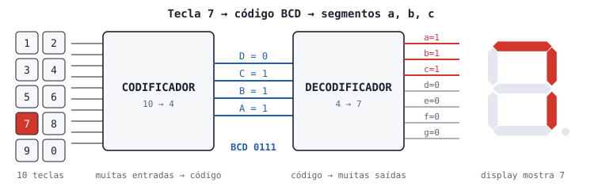

# Aula 05-extra — Codificadores e Decodificadores

> **Duração estimada:** 20 minutos  
> **Bloco:** apoio opcional — Seção 2: Display de 7 Segmentos  
> **Quando ler:** antes da [Aula 6: Display de 7 Segmentos](./aula06-display-7-segmentos.md)

---

## Objetivos

Ao final desta aula você será capaz de:

- Diferenciar um **codificador** de um **decodificador**
- Representar os dígitos de 0 a 9 em **BCD** (4 bits)
- Converter um número de dois dígitos em BCD usando `//` e `%`, e diferenciar BCD de binário puro
- Ler a **tabela-verdade** de um decodificador BCD → 7 segmentos
- Reconhecer os CIs decodificadores CD4511 e 74LS47 e quando cada um é usado
- Entender por que, no ESP32 e no Pico, o decodificador vira **uma tabela dentro do programa**

> 💡 **Esta aula não tem circuito.** O código roda no Wokwi só com o ESP32 (ou o Pico) e mostra tudo no terminal.

---

## 1. Conceito

### O problema: pessoas leem dígitos, circuitos leem bits

Dentro de um circuito digital o número 7 é guardado como `0111`. Para uma pessoa, ele precisa aparecer como o desenho "7". No caminho inverso, quando alguém aperta a tecla "7" de um teclado, o circuito precisa transformar essa tecla em `0111`.

Os dois blocos que fazem essas traduções são o **codificador** e o **decodificador**.



| Bloco | Entradas | Saídas | Exemplo |
|---|---|---|---|
| **Codificador** | muitas (uma ativa por vez) | poucas (um código) | 10 teclas → 4 bits BCD |
| **Decodificador** | poucas (um código) | muitas | 4 bits BCD → 7 segmentos |

> **Regra para lembrar:** o **co**dificador **co**mprime (muitas linhas → um código); o **de**codificador **de**sdobra (um código → muitas linhas).

---

### BCD — decimal codificado em binário

**BCD** (*Binary-Coded Decimal*) representa cada dígito decimal, de 0 a 9, com 4 bits. É o binário que você já conhece, limitado a dez valores:

| Dígito | BCD (D C B A) |
|:---:|:---:|
| 0 | `0000` |
| 1 | `0001` |
| 2 | `0010` |
| 3 | `0011` |
| 4 | `0100` |
| 5 | `0101` |
| 6 | `0110` |
| 7 | `0111` |
| 8 | `1000` |
| 9 | `1001` |

As combinações de `1010` a `1111` (10 a 15) **não são usadas** em BCD.

> 📖 **Saiba mais:** a conversão entre binário e decimal e a leitura de bits individuais com `>>` e `&` foram trabalhadas no Mini-curso 01. Resumo: `(valor >> i) & 1` devolve o bit `i` de `valor`. → [Mini-curso 01 · Aula 3: Listas de pinos e máscara de bits](https://rogeriomb-hub.github.io/minicurso_01-embarcados/aulas/aula03-listas-mascaras)

Um número com mais de um dígito usa um grupo de 4 bits **por dígito**. O número 17, por exemplo, fica `0001 0111` em BCD: o grupo da dezena (1) e o grupo da unidade (7). Essa ideia de tratar cada dígito separadamente volta na Aula 7, quando cada display recebe o seu dígito.

---

### Tabela-verdade do decodificador BCD → 7 segmentos

O decodificador tem **uma saída para cada segmento** do display, chamados de **a** até **g**. O componente em si (ligação, catodo × anodo, resistores) é estudado na [Aula 6](./aula06-display-7-segmentos.md); aqui interessa só o nome de cada segmento:


Esta é a tabela que um decodificador implementa. `1` significa segmento aceso:

| Dígito | BCD | a | b | c | d | e | f | g |
|:---:|:---:|:-:|:-:|:-:|:-:|:-:|:-:|:-:|
| 0 | `0000` | 1 | 1 | 1 | 1 | 1 | 1 | 0 |
| 1 | `0001` | 0 | 1 | 1 | 0 | 0 | 0 | 0 |
| 2 | `0010` | 1 | 1 | 0 | 1 | 1 | 0 | 1 |
| 3 | `0011` | 1 | 1 | 1 | 1 | 0 | 0 | 1 |
| 4 | `0100` | 0 | 1 | 1 | 0 | 0 | 1 | 1 |
| 5 | `0101` | 1 | 0 | 1 | 1 | 0 | 1 | 1 |
| 6 | `0110` | 1 | 0 | 1 | 1 | 1 | 1 | 1 |
| 7 | `0111` | 1 | 1 | 1 | 0 | 0 | 0 | 0 |
| 8 | `1000` | 1 | 1 | 1 | 1 | 1 | 1 | 1 |
| 9 | `1001` | 1 | 1 | 1 | 1 | 0 | 1 | 1 |

Confira duas linhas olhando a figura do display: no "1" só **b** e **c** acendem; no "0" todos acendem menos o **g** (o traço do meio).

---

### O decodificador em hardware

Antes dos microcontroladores, essa tabela era resolvida por um circuito integrado dedicado. Os dois mais comuns:

| CI | Display | Saída ativa em | Datasheet |
|---|---|---|---|
| **CD4511B** (CMOS) | catodo comum | nível **alto** | [TI CD4511B](https://www.ti.com/lit/ds/symlink/cd4511b.pdf) |
| **SN74LS47** (TTL) | anodo comum | nível **baixo** | [TI SN74LS47](https://www.ti.com/lit/ds/symlink/sn74ls47.pdf) |

Os dois recebem 4 bits BCD e entregam os 7 sinais dos segmentos. O CD4511 tem ainda entradas de teste de lâmpada (LT), apagamento (BL) e uma trava (*latch*) que guarda o último código recebido — guarde essa palavra *latch*: ela aparece de novo no 74HC595, na Aula 7.

---

### A virada: o decodificador vira uma tabela no programa

Com um ESP32 ou um Pico não precisamos do CI decodificador. O microcontrolador **guarda a tabela-verdade na memória** e liga os segmentos diretamente. É exatamente isso que a [Aula 6](./aula06-display-7-segmentos.md) faz, escrevendo a tabela acima de quatro formas: lista, dicionário (duas versões) e tupla de bytes.

Isso traz duas vantagens:

- **Flexibilidade:** dá para desenhar letras (A, b, C, d, E, F) e símbolos (traço, grau) só acrescentando linhas na tabela.
- **Menos componentes:** um CI a menos na placa.

O custo é usar mais pinos do microcontrolador (um por segmento). A Aula 7 resolve esse custo com o 74HC595.

---

## 2. Circuito

Nenhum. Crie um projeto **ESP32 + MicroPython** no Wokwi (ou **Raspberry Pi Pico + MicroPython**) e use apenas o terminal.

---

## 3. Código

### Parte A — Codificador: tecla → BCD

O "teclado" é uma lista de 10 posições em que só uma vale `1` (a tecla apertada). O codificador procura essa posição e devolve o seu código BCD.

```python
# ============================================================
# Aula 05-extra — Parte A: codificador decimal → BCD
# Mini-curso 05 — Seção 2: Display de 7 Segmentos
# Roda igual no ESP32 e no Pico (só usa o terminal)
# ============================================================

def codificar(teclas):
    """Recebe uma lista de 10 valores (0 ou 1) com UMA tecla em 1.
    Devolve o número da tecla apertada, ou -1 se nenhuma estiver."""
    for numero, estado in enumerate(teclas):
        if estado == 1:
            return numero
    return -1

# tecla 7 apertada (posições 0 a 9)
teclas = [0, 0, 0, 0, 0, 0, 0, 1, 0, 0]

numero = codificar(teclas)
print("Teclas:", teclas)
print("Tecla apertada:", numero)
print("Código BCD:    {:04b}".format(numero))
```

> 💡 `"{:04b}".format(n)` escreve `n` em binário com 4 casas, completando com zeros à esquerda. É o mesmo recurso usado para imprimir máscaras no Mini-curso 01.

---

### Parte B — Número de dois dígitos em BCD

Um número como 17 não vira um único código BCD: cada dígito vira **o seu grupo de 4 bits**. Para isso o programa precisa primeiro **separar** o número em dezena e unidade:

| Operação | O que faz | 17 | 42 |
|---|---|:---:|:---:|
| `n // 10` | divisão inteira: quantas dezenas cabem | 1 | 4 |
| `n % 10` | resto da divisão por 10: a unidade | 7 | 2 |

> 📖 **Saiba mais:** `//` já foi usado no cálculo de brilho da [Aula 4](./aula04-efeitos-animados.md) e `%` para "dar a volta" no anel da [Aula 2](./aula02-efeitos-lista.md). A mesma separação volta na [Aula 7](./aula07-registrador-74hc595.md), quando cada display recebe o seu dígito.

```python
# ============================================================
# Aula 05-extra — Parte B: número de dois dígitos em BCD
# Roda igual no ESP32 e no Pico (só usa o terminal)
# ============================================================

def bcd4(d):
    """Devolve o dígito d (0 a 9) como texto de 4 bits."""
    return "{:04b}".format(d)

def numero_para_bcd(n):
    """Separa n (0 a 99) em dezena e unidade e devolve os dois grupos BCD."""
    dezena  = n // 10
    unidade = n % 10
    return bcd4(dezena), bcd4(unidade)

print("Número  Dezena  Unidade BCD         Binário puro")
for n in (5, 9, 10, 17, 20, 42, 99):
    dz, un = numero_para_bcd(n)
    print("  {:2d}      {}       {}     {} {}   {:08b}".format(n, n // 10, n % 10, dz, un, n))
```

**Saída esperada:**

```
Número  Dezena  Unidade BCD         Binário puro
   5      0       5     0000 0101   00000101
   9      0       9     0000 1001   00001001
  10      1       0     0001 0000   00001010
  17      1       7     0001 0111   00010001
  20      2       0     0010 0000   00010100
  42      4       2     0100 0010   00101010
  99      9       9     1001 1001   01100011
```

> 💡 **BCD não é o mesmo que binário puro.** Em binário puro, 17 é `00010001` (16 + 1). Em BCD, 17 é `0001 0111`: o 1 e o 7 escritos separadamente. O BCD gasta mais bits, mas cada grupo já é um dígito pronto para um decodificador — ou para um display.

> 💡 **`return bcd4(dezena), bcd4(unidade)`** devolve dois valores de uma vez (uma tupla); a linha `dz, un = numero_para_bcd(n)` recebe cada um numa variável.

---

## 4. Circuito Wokwi — diagram.json

Não há circuito nesta aula. Use o projeto padrão **ESP32 + MicroPython** do Wokwi, sem componentes extras.

---

## 5. Experimento

**a)** Na Parte A, mude a lista para a tecla 3 apertada. Qual código BCD aparece?

> _________________________________________________________________

**b)** Na Parte A, aperte duas teclas ao mesmo tempo (`teclas[2] = 1` e `teclas[5] = 1`). Qual número o codificador devolve? Por quê?

> _________________________________________________________________

**c)** Sem rodar o código, escreva o número 38 em BCD e em binário puro. Depois acrescente o 38 na tupla do `for` da Parte B e confira.

> BCD: `____ ____`   binário puro: `________`

**d)** O código `1010` nunca aparece dentro de um grupo BCD. Por quê?

> _________________________________________________________________

---

## 6. Desafio

**Desafio principal — codificador com prioridade:** no experimento b) você viu que, com duas teclas apertadas, o codificador devolve a **menor**. Os codificadores comerciais (como o 74HC147) fazem o contrário: dão **prioridade à tecla de maior número**. Escreva essa versão percorrendo as teclas de 9 para 0:

```python
def codificar_prioridade(teclas):
    for numero in range(_____, -1, -1):
        if teclas[numero] == 1:
            return _____
    return -1

print(codificar_prioridade([0, 0, 1, 0, 0, 1, 0, 0, 0, 0]))   # → 5
```

**Desafio bônus:** crie a função `codificar_bcd(n)` que devolve uma **lista** com os 4 bits de `n`, do mais significativo para o menos significativo. Use `(n >> i) & 1`.

```python
def codificar_bcd(n):
    bits = []
    for i in range(3, -1, -1):
        bits.append(_____)
    return bits

print(codificar_bcd(9))   # → [1, 0, 0, 1]
```

---

## Resumo da aula

- **Codificador:** muitas entradas, poucas saídas — por exemplo, 10 teclas → 4 bits BCD
- **Decodificador:** poucas entradas, muitas saídas — por exemplo, 4 bits BCD → 7 segmentos
- **BCD** representa cada dígito decimal com 4 bits; números maiores usam um grupo por dígito, separado com `//` e `%`
- BCD não é binário puro: 17 é `0001 0111` em BCD e `00010001` em binário
- CIs como **CD4511** (catodo comum) e **74LS47** (anodo comum) implementam a tabela-verdade em hardware
- No ESP32 e no Pico, a **tabela-verdade vira uma estrutura de dados** no programa — lista, dicionário ou tupla, como você verá na Aula 6

---

*← [Aula 5: Meteoro, Respiração e Cometa](./aula05-meteoro-respiracao-cometa.md) | Próxima → [Aula 6: Display de 7 Segmentos](./aula06-display-7-segmentos.md)*
