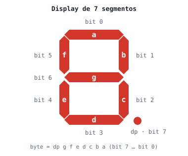
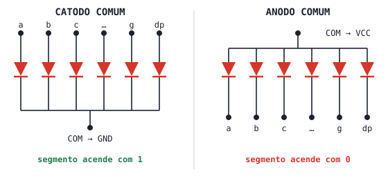

# Aula 6 — Display de 7 Segmentos

> **Duração estimada:** 30 minutos  
> **Bloco:** 1 de 2 — Seção 2: Display de 7 Segmentos

---

## Objetivos

Ao final desta aula você será capaz de:

- Identificar os segmentos **a** a **g** e o ponto **dp** de um display de 7 segmentos
- Explicar a diferença elétrica entre **catodo comum** e **anodo comum**
- Ligar um display de catodo comum ao ESP32 (ou ao Pico) com resistores de proteção
- Escrever dígitos de três formas: **lista**, **dicionário** e **tupla de bytes**
- Comparar as três formas e escolher a mais adequada para cada situação

> 💡 **Novo aqui?** Esta aula transforma a tabela-verdade de um decodificador em código. Se os termos *decodificador*, *BCD* ou *tabela-verdade* ainda não são familiares, leia antes a [Aula 05-extra: Codificadores e Decodificadores](./aula05-extra-codificadores-decodificadores.md).

---

## 1. Conceito

### O componente

Um display de 7 segmentos é um conjunto de **8 LEDs** montados em forma de "8": sete barras (os segmentos **a** a **g**) e um ponto (**dp**, *decimal point*). Acendendo combinações de segmentos, formamos os dígitos de 0 a 9 e algumas letras.



A numeração dos bits na figura (**a = bit 0** … **g = bit 6**, **dp = bit 7**) é a convenção usada nesta aula e na próxima.

---

### Catodo comum × anodo comum

Para economizar pinos, os oito LEDs do display têm **um terminal ligado em comum**. Qual terminal é o comum define o tipo do display:



| | **Catodo comum** (usado em aula) | **Anodo comum** |
|---|---|---|
| Pino comum (COM) ligado a | **GND** | **VCC** (3,3 V) |
| Segmento acende com | nível **alto** (`1`) | nível **baixo** (`0`) |
| Lógica no código | direta | invertida |
| Exemplo comercial | [Kingbright SC56-11EWA](https://www.kingbrightusa.com/images/catalog/SPEC/SC56-11EWA.pdf) | [Kingbright SA56-11EWA](https://www.kingbrightusa.com/images/catalog/SPEC/SA56-11EWA.pdf) |

Os dois datasheets acima são do **mesmo modelo** de 0,56″ (14,2 mm de altura de dígito), diferindo só no terminal comum — abra os dois e compare os desenhos internos na primeira página. Dados importantes do datasheet: tensão direta típica de **1,9 V** a 10 mA e corrente contínua máxima de **30 mA** por segmento.

> ⚠️ **Por fora os dois tipos são idênticos.** A única forma segura de saber é ler o código do componente (por exemplo **SC**56 = catodo, **SA**56 = anodo) ou testar com um resistor e uma fonte.

---

### Pinagem física típica (display de 1 dígito, 0,56″)

Vista de frente, pinos 1 a 5 embaixo (da esquerda para a direita) e 6 a 10 em cima (da direita para a esquerda):

| Pino | 1 | 2 | 3 | 4 | 5 | 6 | 7 | 8 | 9 | 10 |
|---|---|---|---|---|---|---|---|---|---|---|
| Função | e | d | COM | c | dp | b | a | COM | f | g |

> ⚠️ Essa é a pinagem mais comum (modelos 5161, 5611 e equivalentes), e é a mesma do componente do Wokwi. **Confira sempre no datasheet do seu display** antes de ligar.

---

### O resistor de cada segmento

Cada segmento é um LED e precisa de um **resistor em série** para limitar a corrente. Com saída de 3,3 V e LED vermelho (V<sub>F</sub> ≈ 1,9 V):

```
R = (3,3 V − 1,9 V) / I     →  com R = 330 Ω:  I ≈ 4,2 mA por segmento
```

Use **um resistor por segmento** (8 resistores), nunca um só no pino comum: com um resistor único, o brilho mudaria conforme o número de segmentos acesos — o "1" ficaria mais forte que o "8".

> 💡 No Wokwi os resistores podem ser omitidos (o simulador não queima LEDs). Na bancada eles são **obrigatórios**.

---

### Do decodificador para o código

Na [Aula 05-extra](./aula05-extra-codificadores-decodificadores.md) vimos que, no microcontrolador, o decodificador BCD → 7 segmentos vira **uma tabela no programa**. A tabela completa, já com o valor de cada dígito escrito como um byte:

| Dígito | Segmentos acesos | `gfedcba` (binário) | Catodo comum | Anodo comum |
|:---:|---|:---:|:---:|:---:|
| 0 | a b c d e f | `0111111` | `0x3F` | `0xC0` |
| 1 | b c | `0000110` | `0x06` | `0xF9` |
| 2 | a b d e g | `1011011` | `0x5B` | `0xA4` |
| 3 | a b c d g | `1001111` | `0x4F` | `0xB0` |
| 4 | b c f g | `1100110` | `0x66` | `0x99` |
| 5 | a c d f g | `1101101` | `0x6D` | `0x92` |
| 6 | a c d e f g | `1111101` | `0x7D` | `0x82` |
| 7 | a b c | `0000111` | `0x07` | `0xF8` |
| 8 | a b c d e f g | `1111111` | `0x7F` | `0x80` |
| 9 | a b c d f g | `1101111` | `0x6F` | `0x90` |

Repare: a coluna do anodo comum é a do catodo com **todos os bits invertidos**. `0x3F = 0011 1111` vira `0xC0 = 1100 0000`.

Nesta aula vamos escrever essa mesma tabela de **três formas diferentes**:

| Parte | Estrutura | Ideia |
|---|---|---|
| A | **Lista** de listas | a tabela-verdade copiada linha a linha |
| B | **Dicionário** | caractere → nomes dos segmentos acesos |
| C | **Tupla** de bytes | cada dígito é um número de 8 bits |

---

## 2. Circuito

### Ligações

| Segmento | a | b | c | d | e | f | g | dp | COM |
|---|:-:|:-:|:-:|:-:|:-:|:-:|:-:|:-:|:-:|
| **ESP32** | GPIO23 | GPIO22 | GPIO21 | GPIO19 | GPIO18 | GPIO25 | GPIO26 | GPIO27 | GND |
| **Pico** | GP0 | GP1 | GP2 | GP3 | GP4 | GP5 | GP6 | GP7 | GND |

Na bancada: um resistor de **330 Ω** entre cada GPIO e o pino do segmento. Os dois pinos COM (3 e 8) vão ao GND.

> ✅ **Por que esses GPIOs no ESP32?** Todos são de uso geral e seguros para saída:
> - ficam **fora dos pinos de boot** (*strapping*: GPIO 0, 2, 5, 12 e 15), que podem impedir a placa de iniciar ou piscar durante o boot;
> - ficam **fora dos pinos da memória flash** (GPIO 6 a 11);
> - evitam **GPIO 16 e 17**, que nas placas com módulo **WROVER** são usados pela PSRAM (e que não aparecem como pinos livres no ESP32 do Wokwi);
> - evitam **GPIO 34 a 39**, que são **somente entrada**.
>
> No Pico, GP0 a GP7 são todos de uso geral (o terminal do MicroPython usa a USB, não esses pinos).

---

## 3. Código

As três partes usam **o mesmo circuito** e terminam com o mesmo laço de 0 a 9, para você comparar.

> 📖 **Saiba mais — lista de pinos e `enumerate()`:** guardamos os 7 objetos `Pin` numa lista, na ordem a, b, c, …, g. Assim `segmentos[0]` é o **a** e `segmentos[6]` é o **g**, e um `for` com `enumerate()` percorre todos de uma vez, entregando a posição `i` e o pino. → [Mini-curso 01 · Aula 3: Listas de pinos e máscara de bits](https://rogeriomb-hub.github.io/minicurso_01-embarcados/aulas/aula03-listas-mascaras)

### Parte A — Lista de listas

A tabela-verdade do decodificador vira uma **lista com 10 linhas**; cada linha é uma lista com os 7 estados (a até g). `DIGITOS[n]` é a linha do dígito `n`.

```python
# ============================================================
# Aula 06 — Parte A: dígitos com lista de listas
# Mini-curso 05 — Seção 2: Display de 7 Segmentos
# Plataforma principal: ESP32 · display de CATODO COMUM
# ============================================================

from machine import Pin
import utime

# segmentos:  a   b   c   d   e   f   g
GPIOS =      [23, 22, 21, 19, 18, 25, 26]
# Pico: GPIOS = [0, 1, 2, 3, 4, 5, 6]

# cria a lista de pinos, na ordem a, b, c, d, e, f, g
segmentos = []
for g in GPIOS:
    segmentos.append(Pin(g, Pin.OUT))

# --- Tabela-verdade: uma linha por dígito (a b c d e f g) ---
DIGITOS = [
    [1, 1, 1, 1, 1, 1, 0],   # 0
    [0, 1, 1, 0, 0, 0, 0],   # 1
    [1, 1, 0, 1, 1, 0, 1],   # 2
    [1, 1, 1, 1, 0, 0, 1],   # 3
    [0, 1, 1, 0, 0, 1, 1],   # 4
    [1, 0, 1, 1, 0, 1, 1],   # 5
    [1, 0, 1, 1, 1, 1, 1],   # 6
    [1, 1, 1, 0, 0, 0, 0],   # 7
    [1, 1, 1, 1, 1, 1, 1],   # 8
    [1, 1, 1, 1, 0, 1, 1],   # 9
]

def mostrar(n):
    """Acende no display o dígito n (0 a 9)."""
    linha = DIGITOS[n]                  # pega a linha do dígito
    for i, seg in enumerate(segmentos):
        seg.value(linha[i])             # segmento i recebe o estado da coluna i

# --- Contagem de 0 a 9 ---
while True:
    for n in range(10):
        print("Dígito:", n, "→", DIGITOS[n])
        mostrar(n)
        utime.sleep(1)
```

> 💡 **Leia a linha do 7:** `[1, 1, 1, 0, 0, 0, 0]` — **a**, **b** e **c** acesos, o resto apagado. A lista é literalmente a tabela-verdade.

---

### Parte B — Dicionário

Agora a **chave** é o caractere a mostrar (uma string, como `"7"`) e o **valor** é uma string com os **nomes dos segmentos acesos**. A tabela fica parecida com a figura do display e aceita letras e símbolos.

> 📖 **Saiba mais — dicionário e `.get()`:** um dicionário associa uma chave a um valor, como uma agenda associa um nome a um telefone. `SEGS.get(c, "")` busca a chave `c` e, se ela não existir, devolve `""` em vez de travar o programa com `KeyError`. → [Aula 3: Paleta de cores com dicionário](./aula03-paleta-dicionario.md)

```python
# ============================================================
# Aula 06 — Parte B: dígitos e letras com dicionário
# ============================================================

from machine import Pin
import utime

# segmentos:  a   b   c   d   e   f   g
GPIOS =      [23, 22, 21, 19, 18, 25, 26]
# Pico: GPIOS = [0, 1, 2, 3, 4, 5, 6]

segmentos = []
for g in GPIOS:
    segmentos.append(Pin(g, Pin.OUT))

NOMES = "abcdefg"     # NOMES[i] é o nome do segmento da posição i

# --- caractere → segmentos acesos ---
SEGS = {
    "0": "abcdef",
    "1": "bc",
    "2": "abdeg",
    "3": "abcdg",
    "4": "bcfg",
    "5": "acdfg",
    "6": "acdefg",
    "7": "abc",
    "8": "abcdefg",
    "9": "abcdfg",
    "E": "adefg",     # letras também cabem na tabela
    "-": "g",         # traço do meio
}

def mostrar(c):
    """Acende o caractere c. Caractere desconhecido apaga o display."""
    acesos = SEGS.get(c, "")
    for i, seg in enumerate(segmentos):
        if NOMES[i] in acesos:          # o nome deste segmento está na string?
            seg.value(1)
        else:
            seg.value(0)

# --- Contagem de 0 a 9, depois "E" e "-" ---
while True:
    for c in "0123456789E-":
        print("Caractere:", c, "→ segmentos", SEGS.get(c, ""))
        mostrar(c)
        utime.sleep(1)
```

> 💡 **`for c in "0123456789E-"`** percorre uma string caractere por caractere. E `"b" in "abcdg"` vale `True` porque a letra `b` aparece dentro da string.

---

### Parte C — Tupla de bytes

Cada dígito vira **um único número de 8 bits**: o bit 0 é o segmento **a**, o bit 1 é o **b**, e assim por diante (veja a figura do início). A tabela inteira cabe numa **tupla** de 10 números.

> 📖 **Saiba mais — tupla:** uma tupla é uma sequência **imutável**, escrita entre parênteses. É a estrutura certa para uma tabela fixa que o programa só consulta e nunca altera. → [Aula 00-extra: Tuplas em Python](./aula00-extra-tuplas.md)

> 📖 **Saiba mais — extrair um bit:** `(byte >> i) & 1` desloca o byte `i` posições para a direita e isola o último bit com a máscara `1`. O resultado é o estado do segmento `i`. → [Mini-curso 01 · Aula 4: Deslocamento e escrita direta em porta](https://rogeriomb-hub.github.io/minicurso_01-embarcados/aulas/aula04-deslocamento-escrita-porta) · [Mini-curso 01 · Aula 2: Operadores bitwise](https://rogeriomb-hub.github.io/minicurso_01-embarcados/aulas/aula02-operadores-bitwise)

```python
# ============================================================
# Aula 06 — Parte C: dígitos com tupla de bytes
# ============================================================

from machine import Pin
import utime

# segmentos:  a   b   c   d   e   f   g   dp
GPIOS =      [23, 22, 21, 19, 18, 25, 26, 27]
# Pico: GPIOS = [0, 1, 2, 3, 4, 5, 6, 7]

segmentos = []
for g in GPIOS:
    segmentos.append(Pin(g, Pin.OUT))

# --- um byte por dígito, bits: dp g f e d c b a ---
CODIGOS = (0x3F, 0x06, 0x5B, 0x4F, 0x66, 0x6D, 0x7D, 0x07, 0x7F, 0x6F)
#           0     1     2     3     4     5     6     7     8     9

ANODO_COMUM = False   # mude para True se o display for de anodo comum

def escrever_byte(byte):
    """Liga cada um dos 8 pinos conforme o bit correspondente do byte."""
    if ANODO_COMUM:
        byte = ~byte & 0xFF            # inverte os 8 bits (lógica invertida)
    for i, seg in enumerate(segmentos):
        seg.value((byte >> i) & 1)     # bit i → segmento i

def mostrar(n):
    escrever_byte(CODIGOS[n])

# --- Contagem de 0 a 9 ---
while True:
    for n in range(10):
        print("Dígito: {}  código: 0x{:02X} = {:08b}".format(n, CODIGOS[n], CODIGOS[n]))
        mostrar(n)
        utime.sleep(1)
```

> 💡 **Por que `& 0xFF` depois do `~`?** Em Python, `~0x3F` vale `-64` (o número é tratado como inteiro com sinal). A máscara `& 0xFF` guarda só os 8 bits que interessam: `~0x3F & 0xFF = 0xC0`.

---

### Comparando as três formas

| | A — Lista | B — Dicionário | C — Tupla de bytes |
|---|---|---|---|
| Tamanho da tabela | 10 linhas × 7 valores | 1 linha por caractere | 10 números |
| Facilidade de ler | ótima (é a tabela-verdade) | ótima (nomes dos segmentos) | exige pensar em bits |
| Aceita letras e símbolos | sim, mas por índice numérico | **sim, pelo próprio caractere** | sim, mas por índice numérico |
| Trocar para anodo comum | inverter cada 0/1 | inverter no `seg.value()` | **uma linha** (`~byte & 0xFF`) |
| Próxima do hardware | média | baixa | **alta: o byte vai inteiro para um registrador** |

A Parte C é a que usaremos na próxima aula: o **74HC595** recebe exatamente um byte e liga os 8 segmentos de uma vez.

---

## 4. Circuito Wokwi — diagram.json

Cole o conteúdo abaixo no arquivo `diagram.json` do seu projeto Wokwi (**ESP32 + MicroPython**). O mesmo circuito serve para as Partes A, B e C.

```json
{
  "version": 1,
  "author": "Rogerio M B",
  "editor": "wokwi",
  "parts": [
    {
      "type": "board-esp32-devkit-c-v4",
      "id": "esp",
      "top": 115.2,
      "left": -4.76,
      "attrs": { "env": "micropython-20260406-v1.28.0" }
    },
    {
      "type": "wokwi-7segment",
      "id": "sevseg1",
      "top": 4.98,
      "left": 24.28,
      "attrs": { "common": "cathode" }
    },
    {
      "type": "wokwi-resistor",
      "id": "r1",
      "top": -15.25,
      "left": -57.6,
      "attrs": { "value": "330" }
    },
    {
      "type": "wokwi-resistor",
      "id": "r2",
      "top": -24.85,
      "left": -57.6,
      "attrs": { "value": "330" }
    },
    {
      "type": "wokwi-resistor",
      "id": "r3",
      "top": -15.25,
      "left": 115.2,
      "attrs": { "value": "330" }
    },
    {
      "type": "wokwi-resistor",
      "id": "r4",
      "top": -24.85,
      "left": 115.2,
      "attrs": { "value": "330" }
    },
    {
      "type": "wokwi-resistor",
      "id": "r5",
      "top": 215.15,
      "left": 144,
      "attrs": { "value": "330" }
    },
    {
      "type": "wokwi-resistor",
      "id": "r6",
      "top": 205.55,
      "left": 144,
      "attrs": { "value": "330" }
    },
    {
      "type": "wokwi-resistor",
      "id": "r7",
      "top": 186.35,
      "left": 144,
      "attrs": { "value": "330" }
    }
  ],
  "connections": [
    [ "esp:TX", "$serialMonitor:RX", "", [] ],
    [ "esp:RX", "$serialMonitor:TX", "", [] ],
    [ "esp:GND.2", "sevseg1:COM.2", "black", [ "h115.2", "v-172.8", "h-163.2" ] ],
    [ "esp:26", "r1:1", "green", [ "h-67.05", "v-240" ] ],
    [ "r1:2", "sevseg1:G", "green", [ "v0", "h27.6" ] ],
    [ "sevseg1:F", "r2:2", "green", [ "v0" ] ],
    [ "r2:1", "esp:25", "green", [ "v0", "h-28.8", "v240" ] ],
    [ "esp:22", "r4:2", "green", [ "h105.6", "v-182.4" ] ],
    [ "r4:1", "sevseg1:B", "green", [ "v0", "h-48" ] ],
    [ "esp:23", "r3:2", "green", [ "h96", "v-163.2" ] ],
    [ "r3:1", "sevseg1:A", "green", [ "v0", "h-57.6" ] ],
    [ "esp:18", "r5:1", "green", [ "h0" ] ],
    [ "r5:2", "sevseg1:E", "green", [ "h37.2", "v-115.2", "h-211.2" ] ],
    [ "sevseg1:D", "r6:2", "green", [ "v19.2", "h192", "v115.2" ] ],
    [ "r6:1", "esp:19", "green", [ "v0" ] ],
    [ "esp:21", "r7:1", "green", [ "h0" ] ],
    [ "r7:2", "sevseg1:C", "green", [ "h18", "v-105.6", "h-163.2" ] ]
  ],
  "dependencies": {}
}```

> ⚠️ **Validar antes de publicar** — rode a Parte A e confirme a contagem de 0 a 9. Os fios são desenhados em linha reta; arraste-os no editor do Wokwi para organizar.

> ⚠️ **Atenção ao atributo `common`:** o padrão do componente `wokwi-7segment` é **anodo** comum. Sem a linha `"common": "cathode"`, o display mostra os segmentos invertidos.

---

## 5. Experimento

Execute a **Parte A** e responda:

**a)** Complete a linha do dígito 4 sem olhar o código, só pela figura do display:

```python
[_____, _____, _____, _____, _____, _____, _____],   # 4
```

Execute a **Parte B**:

**b)** Acrescente ao dicionário a entrada da letra **H** (segmentos b, c, e, f, g) e inclua-a na string do `for`. Escreva a linha:

```python
"H": "_____",
```

Execute a **Parte C** e observe o terminal:

**c)** Quanto vale `(0x5B >> 2) & 1`? O segmento **c** acende no dígito 2?

> _________________________________________________________________

**d)** No `diagram.json`, troque `"cathode"` por `"anode"` e ligue `COM.1` e `COM.2` ao `esp:3V3`, **sem mudar o código**. O que aparece no display? Depois mude `ANODO_COMUM = True` e rode de novo.

> _________________________________________________________________

---

## 6. Desafio

**Desafio principal:** usando a Parte B, faça um contador **hexadecimal** de 0 a F. Acrescente ao dicionário as letras que faltam (A, b, C, d, F) e mude a string do `for`.

```python
SEGS["A"] = "_____"
SEGS["b"] = "cdefg"
SEGS["C"] = "_____"
SEGS["d"] = "_____"
SEGS["F"] = "_____"

for c in "0123456789Ab_____":
    mostrar(c)
    utime.sleep(1)
```

**Desafio bônus:** na Parte C, faça o ponto decimal (**dp**, bit 7) piscar a cada meio segundo **sem alterar o dígito**. Dica: o operador `|` liga um bit sem mexer nos outros.

```python
for n in range(10):
    escrever_byte(CODIGOS[n] | (1 << _____))   # dígito com ponto
    utime.sleep(0.5)
    escrever_byte(CODIGOS[n])                  # dígito sem ponto
    utime.sleep(0.5)
```

---

## Resumo da aula

- O display de 7 segmentos tem 8 LEDs (a–g e dp) com **um terminal em comum**
- **Catodo comum:** COM no GND, segmento acende com `1` · **Anodo comum:** COM no VCC, acende com `0`
- Cada segmento precisa do **seu próprio resistor** (330 Ω com 3,3 V)
- A tabela-verdade do decodificador pode virar uma **lista** (Parte A), um **dicionário** (Parte B) ou uma **tupla de bytes** (Parte C)
- Com bytes, trocar de catodo para anodo é só inverter os bits: `~byte & 0xFF`
- Um dígito custou **8 GPIOs**. Dois dígitos custariam 16 — a Aula 7 resolve isso com o 74HC595

---

*← [Aula 05-extra: Codificadores e Decodificadores](./aula05-extra-codificadores-decodificadores.md) | Próxima → [Aula 7: Registrador de Deslocamento 74HC595](./aula07-registrador-74hc595.md)*
