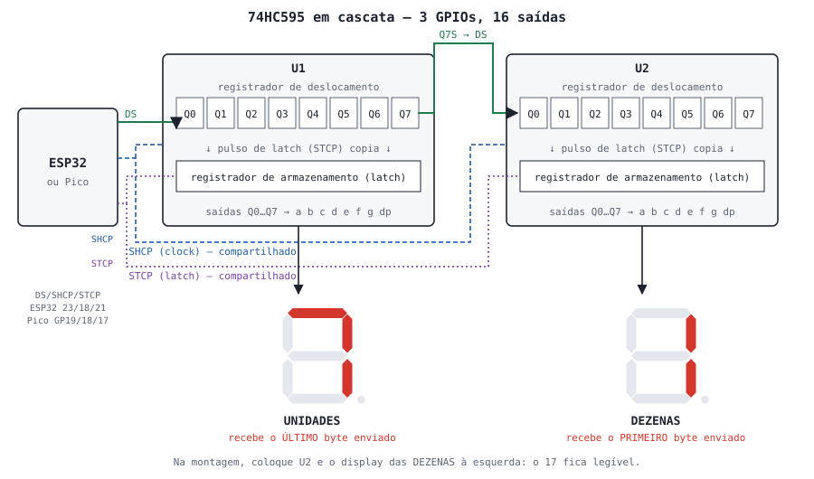
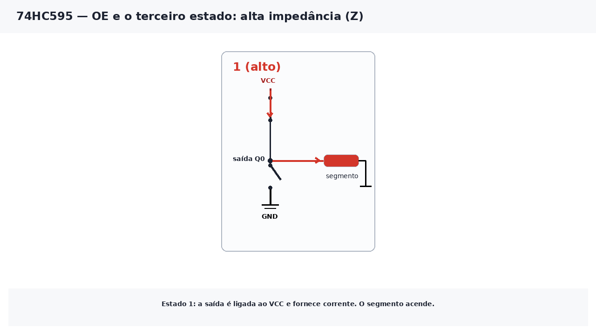

# Aula 7 — Registrador de Deslocamento 74HC595

> **Duração estimada:** 30 minutos + projeto final  
> **Bloco:** 2 de 2 — Seção 2: Display de 7 Segmentos

---

## Objetivos

Ao final desta aula você será capaz de:

- Explicar o que é um **registrador de deslocamento** do tipo série → paralelo
- Identificar os pinos do **74HC595** no datasheet e no Wokwi
- Enviar um byte bit a bit usando **dado**, **clock** e **latch**
- Ligar dois 74HC595 **em cascata** usando apenas 3 GPIOs
- Separar um número em **dezena** e **unidade** com `//` e `%`
- Montar um contador de **00 a 20** em dois displays de catodo comum
- Explicar o **terceiro estado** (alta impedância) e usar o pino **OE** para apagar o display sem perder os dados

> 💡 **Vem da Aula 6?** Esta aula usa a **Parte C** da aula anterior: a tupla `CODIGOS`, com um byte por dígito. Se ainda não fez, comece pela [Aula 6](./aula06-display-7-segmentos.md).

---

## 1. Conceito

### O problema: pinos demais

Na Aula 6, **um** dígito usou **8 GPIOs**. Para mostrar um número de dois dígitos seriam 16; para um relógio de quatro dígitos, 32 — mais do que o ESP32 tem livres.

O **74HC595** resolve isso: com **3 GPIOs** ele controla 8 saídas, e vários 595 podem ser ligados **em cascata** usando os mesmos 3 GPIOs. Cada chip a mais acrescenta 8 saídas **sem custar nenhum pino** do microcontrolador.

---

### O que é o 74HC595

É um **registrador de deslocamento** de 8 bits, do tipo **série → paralelo** (*Serial-In, Parallel-Out*, SIPO):

- **série** na entrada: os bits chegam **um de cada vez**, por um único fio;
- **paralelo** na saída: os 8 bits aparecem **todos juntos**, em 8 pinos.

Dentro dele há **dois blocos** de 8 bits:

1. **Registrador de deslocamento** — a cada pulso de **clock**, recebe um bit novo na primeira posição e empurra os outros uma posição adiante. O bit que sai da última posição vai para o pino **Q7S**, que serve para alimentar o próximo 595.
2. **Registrador de armazenamento** (*latch*) — copia os 8 bits do primeiro bloco **somente quando recebe um pulso no pino de latch**. São as saídas dele que ligam o display.

Esse segundo bloco é o que impede o display de "piscar": enquanto os bits estão andando no primeiro bloco, as saídas continuam mostrando o valor antigo. Só no pulso de latch o display troca, de uma vez.

> 📖 **Saiba mais — comunicação serial com clock:** um fio de dados e um fio de clock que diz *quando* ler cada bit é a mesma ideia do barramento **SPI**, usado pelo display TFT do Mini-curso 04. Por isso o 595 também pode ser comandado pela SPI de hardware (veja o desafio bônus). → [Mini-curso 04 · Aula 1: Fundamentos do SPI](https://rogeriomb-hub.github.io/minicurso_04-embarcados/aulas/aula01-fundamentos-spi)
>
> Compare com a **UART**, que é serial **sem** fio de clock: os dois lados combinam a velocidade antes. → [Mini-curso 01 · Aula 7: UART](https://rogeriomb-hub.github.io/minicurso_01-embarcados/aulas/aula07-uart-primeiros-bytes)

---

### Pinagem: datasheet × Wokwi

Os fabricantes usam nomes diferentes para os mesmos pinos. A tabela relaciona o [datasheet da Texas Instruments (SN74HC595)](https://www.ti.com/lit/ds/symlink/sn74hc595.pdf) com os nomes do [componente do Wokwi](https://docs.wokwi.com/parts/wokwi-74hc595):

| Pino (DIP-16) | Nome TI | Nome Wokwi | Função | Ligação |
|:---:|---|---|---|---|
| 14 | SER | **DS** | entrada de dados serial | GPIO de dados |
| 11 | SRCLK | **SHCP** | clock do deslocamento (borda de subida) | GPIO de clock |
| 12 | RCLK | **STCP** | clock do armazenamento — **latch** (borda de subida) | GPIO de latch |
| 13 | OE | OE | habilita as saídas — ativo em **0** | GND (sempre habilitado); na Parte D, um GPIO |
| 10 | SRCLR | MR | limpa o registrador — ativo em **0** | VCC (nunca limpa) |
| 15, 1–7 | QA, QB … QH | Q0, Q1 … Q7 | saídas paralelas | segmentos a … g, dp |
| 9 | QH′ | **Q7S** | saída serial para a cascata | DS do próximo 595 |
| 16 | VCC | VCC | alimentação | 3,3 V |
| 8 | GND | GND | terra | GND |

> 💡 **OE e MR têm "barra" em cima no datasheet** (`OE̅`, `SRCLR̅`): isso indica que são **ativos em nível baixo**. Por isso OE vai ao GND (saídas sempre ligadas) e MR vai ao VCC (o registrador nunca é limpo).

---

### Figura e diagrama de blocos do deslocamento

O diagrama abaixo mostra o sistema completo desta aula: o ESP32 envia os bits para **U1**; quando um bit passa da última posição de U1, ele segue por **Q7S** para **U2**. Os sinais de clock (SHCP) e de latch (STCP) são **compartilhados** pelos dois chips.



**Consequência importante:** o **primeiro byte enviado vai mais longe**. Com dois chips em cascata e 16 pulsos de clock, o primeiro byte atravessa U1 e termina em U2; o segundo byte fica em U1.

---

### O deslocamento, pulso a pulso

Vamos acompanhar o dígito **2** (`0x5B = 0101 1011`) entrando em um 595. Os bits são enviados **do bit 7 para o bit 0**, para que, ao final, o bit 0 (segmento **a**) esteja em Q0.

A animação junta o **diagrama de tempo** (em cima) e o **interior do chip** (embaixo). A barra laranja para em cada **borda de subida do SHCP**, e nesse instante o bit que está no DS entra no Q0. Cada bit do 2 tem uma cor própria, para você acompanhar o caminho dele; os bits cinza são do dígito anterior, **1**, que continua no display até a borda do **STCP**.


| Borda | Bit lido no DS | Registrador de deslocamento (Q0 … Q7) | Display |
|:---:|---|:---:|:---:|
| antes | — | `0 1 1 0 0 0 0 0` (dígito 1) | 1 |
| SHCP 1 | 0 — b7 (dp) | `0 0 1 1 0 0 0 0` | 1 |
| SHCP 2 | 1 — b6 (g) | `1 0 0 1 1 0 0 0` | 1 |
| SHCP 3 | 0 — b5 (f) | `0 1 0 0 1 1 0 0` | 1 |
| SHCP 4 | 1 — b4 (e) | `1 0 1 0 0 1 1 0` | 1 |
| SHCP 5 | 1 — b3 (d) | `1 1 0 1 0 0 1 1` | 1 |
| SHCP 6 | 0 — b2 (c) | `0 1 1 0 1 0 0 1` | 1 |
| SHCP 7 | 1 — b1 (b) | `1 0 1 1 0 1 0 0` | 1 |
| SHCP 8 | 1 — b0 (a) | `1 1 0 1 1 0 1 0` | 1 |
| **STCP** | — | latch recebe `1 1 0 1 1 0 1 0` | **2** |

Leia a tabela na diagonal: o b7, que entrou no Q0 na borda 1, aparece uma casa mais à direita a cada linha, até chegar ao Q7 na borda 8. Por isso o **primeiro** bit enviado termina no **dp** e o **último** (b0) termina no segmento **a**.

Em Python, cada borda faz com o registrador o que `(registro << 1) | bit` faz com um número: o bit novo vira o bit 0 (Q0) e os outros sobem uma posição. Na figura isso aparece como "uma casa para a direita", porque o Q0 está desenhado à esquerda.

> ⚠️ **Duas ordens de leitura.** A figura e a tabela acima mostram Q0 … Q7 da esquerda para a direita, na ordem física das saídas. Já o terminal da **Parte B** imprime o registrador como **número binário**, na ordem Q7 … Q0 (o bit 0 à direita). Depois da borda 8, por exemplo, a tabela mostra `1 1 0 1 1 0 1 0` e o terminal mostra `01011011`: é o mesmo conteúdo lido ao contrário.

> 📖 **Saiba mais — deslocamento de bits:** `<<` empurra todos os bits uma posição para a esquerda e coloca `0` à direita; o `| bit` coloca o bit novo nessa posição. É o mesmo "LED caminhando" do sequenciador do Mini-curso 01, agora acontecendo dentro de um chip. → [Mini-curso 01 · Aula 4: Deslocamento e escrita direta em porta](https://rogeriomb-hub.github.io/minicurso_01-embarcados/aulas/aula04-deslocamento-escrita-porta)

---

### A sequência para enviar um byte

Para cada um dos 8 bits, do bit 7 ao bit 0:

1. coloque o bit no pino **DS** (`0` ou `1`);
2. dê um **pulso** em **SHCP** (sobe para `1` e volta a `0`) — o bit entra e os outros andam.

Depois do último bit:

3. dê um **pulso** em **STCP** — o display mostra o novo valor.

Em código, a extração de cada bit usa a mesma máscara da Aula 6: `(valor >> i) & 1`.

---

### OE e o terceiro estado: alta impedância

Até aqui ligamos o **OE** ao GND e esquecemos dele. Mas ele resolve problemas reais, e por trás dele está uma ideia nova da eletrônica digital: uma saída pode ter **três estados**, não só dois.

Pense em cada saída Q do 595 como **duas chaves**: uma liga a saída ao VCC, a outra liga ao GND.

| Estado da saída | Chave para o VCC | Chave para o GND | O que a saída faz | Segmento (catodo comum) |
|:---:|:---:|:---:|---|:---:|
| **1** (alto) | fechada | aberta | fornece corrente | acende |
| **0** (baixo) | aberta | fechada | absorve corrente | apaga |
| **Z** (alta impedância) | aberta | aberta | **fica desconectada**, como um fio cortado | apaga |

O pino **OE** (*Output Enable*, ativo em **0**) escolhe entre os dois primeiros casos e o terceiro:

- **OE = 0:** as saídas Q0…Q7 mostram o que está no registrador de armazenamento (1 ou 0).
- **OE = 1:** as saídas Q0…Q7 vão para **Z**, todas ao mesmo tempo. O display apaga, mas **os dados continuam guardados** no latch. Quando o OE volta a 0, o mesmo número reaparece, sem reenviar nada.



**Para que serve na prática:**

| Situação | Como o OE ajuda |
|---|---|
| **Ao ligar o circuito** | O conteúdo dos registradores é **indefinido** até o programa enviar o primeiro byte: o display mostraria "lixo". Um resistor de **10 kΩ** do OE para o 3,3 V mantém as saídas em Z até o programa carregar os dados e colocar OE em 0. |
| **Apagar ou piscar o display** | Uma única escrita no OE apaga tudo, sem perder o número guardado (Parte D). |
| **Ajustar o brilho** | Um sinal PWM no OE liga e desliga as saídas muito rápido; o olho percebe um brilho menor (desafio bônus). |
| **Compartilhar fios** | Vários chips podem ter as saídas ligadas aos mesmos fios (um **barramento**): só o que está com OE = 0 "fala"; os outros ficam em Z e não atrapalham. É por isso que o datasheet chama essas saídas de *3-state*. |

> 💡 **Dois detalhes do datasheet:**
> - O **OE não afeta o Q7S**. Mesmo com o display apagado, os bits continuam passando para o próximo 595 da cascata.
> - O **MR** (*SRCLR*) limpa só o registrador de **deslocamento**; o que está no latch e nas saídas não muda até o próximo pulso de STCP.

---

## 2. Circuito

### Ligações

| Sinal | 74HC595 | ESP32 | Pico |
|---|---|:---:|:---:|
| Dados | U1 · DS | GPIO23 | GP19 |
| Clock | U1 · SHCP **e** U2 · SHCP | GPIO18 | GP18 |
| Latch | U1 · STCP **e** U2 · STCP | GPIO21 | GP17 |
| Cascata | U1 · Q7S → U2 · DS | — | — |
| Habilita saídas | OE dos dois → GND (na Parte D: → GPIO) | GND (Parte D: GPIO22) | GND (Parte D: GP20) |
| Reset | MR dos dois → 3,3 V | 3V3 | 3V3(OUT) |
| Alimentação | VCC dos dois → 3,3 V | 3V3 | 3V3(OUT) |

| Saída do 595 | Q0 | Q1 | Q2 | Q3 | Q4 | Q5 | Q6 | Q7 |
|---|:-:|:-:|:-:|:-:|:-:|:-:|:-:|:-:|
| Segmento | a | b | c | d | e | f | g | dp |

- **U1** (o 595 ligado ao ESP32) aciona o display da **direita — UNIDADES**
- **U2** (o segundo da cascata) aciona o display da **esquerda — DEZENAS**
- Os dois displays são de **catodo comum**, com COM no GND
- Na bancada: um resistor de **330 Ω** entre cada saída Q e o segmento (16 resistores no total)

> ✅ **Por que esses GPIOs?**
> - **GPIO23 e GPIO18** são os pinos **MOSI** e **SCK** da SPI de hardware do ESP32 (VSPI); **GP19 e GP18** são **TX** e **SCK** da SPI0 do Pico. Assim o mesmo circuito funciona com o desafio bônus de SPI.
> - **GPIO21** é de uso geral. Evitamos o GPIO5 (sugestão comum em tutoriais) porque ele é **pino de boot** do ESP32 e oscila durante a inicialização, o que daria um pulso de latch falso.

> ⚠️ **Tensão de alimentação do 595 — 3,3 V, não 5 V.** O 74HC595 funciona de 2 V a 6 V. Alimentado com 5 V, ele só reconhece como nível alto uma entrada a partir de **3,15 V**, e o ESP32/Pico entregam 3,3 V: fica no limite e pode falhar na bancada. Alimente o 595 com **3,3 V**, junto do microcontrolador. Se for obrigatório usar 5 V, troque pelo **74HCT595**, que aceita 3,3 V como nível alto.

> ⚠️ **Corrente:** o datasheet garante ±6 mA por saída com 4,5 V de alimentação e limita o chip inteiro a **70 mA**. Em 3,3 V a saída fornece um pouco menos, então o segmento fica um pouco menos brilhante. Com 330 Ω cada segmento consome cerca de 4 mA e 8 segmentos acesos ficam perto de 34 mA por chip — dentro do limite. Se o brilho ficar fraco na bancada, use 220 Ω (cerca de 6 mA por segmento, ainda abaixo dos 70 mA do chip).

> 💡 **Capacitor de desacoplamento:** na bancada, coloque um capacitor cerâmico de **100 nF** entre VCC e GND de cada 595, o mais perto possível do chip (recomendação do datasheet).

---

## 3. Código

As três partes usam **o mesmo circuito** (dois 595 e dois displays).

> 📖 **Saiba mais — `for` com `range()` decrescente:** `range(7, -1, -1)` gera 7, 6, 5, 4, 3, 2, 1, 0 — começa em 7, para **antes** de −1 e anda de −1 em −1. → [Mini-curso 01 · Extra: for e range()](https://rogeriomb-hub.github.io/minicurso_01-embarcados/aulas/aula02-extra-for-range)

### Parte A — Enviar um byte: contador de 0 a 9

Primeiro, só um dígito. A função `enviar_byte()` faz os passos 1 e 2 para os 8 bits; o pulso de latch vem depois.

```python
# ============================================================
# Aula 07 — Parte A: enviar um byte ao 74HC595
# Mini-curso 05 — Seção 2: Display de 7 Segmentos
# Plataforma principal: ESP32 · displays de CATODO COMUM
# ============================================================

from machine import Pin
import utime

# --- 3 pinos para o 74HC595 (começam em 0) ---
ds   = Pin(23, Pin.OUT, value=0)   # DS   — dados
shcp = Pin(18, Pin.OUT, value=0)   # SHCP — clock do deslocamento
stcp = Pin(21, Pin.OUT, value=0)   # STCP — latch
# Pico: ds = Pin(19, ...)  shcp = Pin(18, ...)  stcp = Pin(17, ...)

# --- mesma tupla da Aula 6, Parte C (bits: dp g f e d c b a) ---
CODIGOS = (0x3F, 0x06, 0x5B, 0x4F, 0x66, 0x6D, 0x7D, 0x07, 0x7F, 0x6F)

def pulso(pino):
    """Sobe o pino para 1 e volta para 0: uma borda de subida."""
    pino.value(1)
    pino.value(0)

def enviar_byte(valor):
    """Envia os 8 bits de valor, do bit 7 (dp) ao bit 0 (a)."""
    for i in range(7, -1, -1):
        ds.value((valor >> i) & 1)     # passo 1: coloca o bit em DS
        pulso(shcp)                    # passo 2: o bit entra, os outros andam

def mostrar_digito(n):
    enviar_byte(CODIGOS[n])
    pulso(stcp)                        # passo 3: o display troca de uma vez

# --- Contagem de 0 a 9 no display das UNIDADES ---
while True:
    for n in range(10):
        print("Dígito:", n)
        mostrar_digito(n)
        utime.sleep(1)
```

> 🔍 **Observe o display das dezenas** enquanto a Parte A roda. Ele não está "desligado" — responda no Experimento o que ele mostra e por quê.

---

### Parte B — Câmera lenta: ver os bits andando

Esta parte desacelera tudo: dá um pulso de latch **depois de cada bit**, para você ver no display o deslocamento acontecendo, e imprime no terminal uma cópia do registrador.

```python
# ============================================================
# Aula 07 — Parte B: deslocamento em câmera lenta
# ============================================================

from machine import Pin
import utime

ds   = Pin(23, Pin.OUT, value=0)   # Pico: Pin(19, ...)
shcp = Pin(18, Pin.OUT, value=0)   # Pico: Pin(18, ...)
stcp = Pin(21, Pin.OUT, value=0)   # Pico: Pin(17, ...)

def pulso(pino):
    pino.value(1)
    pino.value(0)

registro = 0      # cópia, no programa, do que está dentro de U1

def enviar_bit_lento(bit):
    global registro
    ds.value(bit)
    pulso(shcp)                                   # o bit entra no 595...
    registro = ((registro << 1) | bit) & 0xFF     # ...e na nossa cópia
    pulso(stcp)                                   # latch a cada bit: só para VER
    print("entrou {}  →  Q7..Q0 = {:08b}".format(bit, registro))
    utime.sleep(1)

# --- envia o dígito 2 (0x5B), um bit por segundo ---
VALOR = 0x5B
print("Enviando {:08b} (dígito 2), do bit 7 ao bit 0".format(VALOR))
for i in range(7, -1, -1):
    enviar_bit_lento((VALOR >> i) & 1)
print("Pronto: o display das unidades mostra o 2.")
```

> 💡 **Compare o terminal com a tabela "O deslocamento, pulso a pulso"** do Conceito. Cada linha impressa é uma linha da tabela.

---

### Separando dezena e unidade

Para mostrar um número de dois dígitos, cada display precisa do **seu** dígito. Dois operadores resolvem isso:

```python
n = 17
dezena  = n // 10    # divisão inteira: quantas dezenas cabem → 1
unidade = n % 10     # resto da divisão por 10              → 7
```

| `n` | `n // 10` | `n % 10` | Display |
|:---:|:---:|:---:|:---:|
| 5 | 0 | 5 | `05` |
| 17 | 1 | 7 | `17` |
| 20 | 2 | 0 | `20` |

> 📖 **Saiba mais:** `//` já foi usado no cálculo de brilho da [Aula 4](./aula04-efeitos-animados.md) e `%` para "dar a volta" no anel da [Aula 2](./aula02-efeitos-lista.md). Aqui os dois juntos fazem o papel do **codificador BCD** da [Aula 05-extra](./aula05-extra-codificadores-decodificadores.md): separam o número em um dígito por display.

---

### Parte C — Aplicação final: contagem de 00 a 20

```python
# ============================================================
# Aula 07 — Parte C: contador 00 a 20 com dois 74HC595
# Mini-curso 05 — Seção 2: Display de 7 Segmentos
# Plataforma principal: ESP32 · displays de CATODO COMUM
#   U1 (ligado ao ESP32)  → display das UNIDADES (direita)
#   U2 (Q7S de U1 → DS)   → display das DEZENAS  (esquerda)
# ============================================================

from machine import Pin
import utime

ds   = Pin(23, Pin.OUT, value=0)   # DS   — dados
shcp = Pin(18, Pin.OUT, value=0)   # SHCP — clock (U1 e U2)
stcp = Pin(21, Pin.OUT, value=0)   # STCP — latch (U1 e U2)
# Pico: ds = Pin(19, ...)  shcp = Pin(18, ...)  stcp = Pin(17, ...)

CODIGOS = (0x3F, 0x06, 0x5B, 0x4F, 0x66, 0x6D, 0x7D, 0x07, 0x7F, 0x6F)

def pulso(pino):
    pino.value(1)
    pino.value(0)

def enviar_byte(valor):
    for i in range(7, -1, -1):
        ds.value((valor >> i) & 1)
        pulso(shcp)

def mostrar_numero(n):
    """Mostra n (0 a 99) nos dois displays."""
    dezena  = n // 10
    unidade = n % 10
    enviar_byte(CODIGOS[dezena])    # 1º byte: atravessa U1 e termina em U2
    enviar_byte(CODIGOS[unidade])   # 2º byte: fica em U1
    pulso(stcp)                     # os dois displays trocam juntos

# --- Contagem de 00 a 20, recomeçando ---
while True:
    for n in range(21):
        print("Número: {:02d}".format(n))
        mostrar_numero(n)
        utime.sleep(0.5)
```

> 💡 **Conta de pinos:** 2 displays × 8 segmentos = **16 saídas** usando **3 GPIOs**. Um terceiro 595 em cascata daria 24 saídas — com os mesmos 3 GPIOs.

---

### Parte D — OE: apagar o display sem perder os dados

Esta parte usa **um quarto GPIO** para o OE. No circuito, tire os fios do **OE** dos dois 595 do GND e ligue os dois ao **GPIO22** (no Pico, **GP20**). Veja as duas linhas a trocar no `diagram.json`, na seção 4.

> ✅ **Por que GPIO22 e GP20?** São de uso geral e não coincidem com os pinos da SPI usados no desafio bônus (no ESP32, o GPIO19 é o MISO da SPI; no Pico, o GP16).

```python
# ============================================================
# Aula 07 — Parte D: OE e alta impedância
# Mini-curso 05 — Seção 2: Display de 7 Segmentos
# Plataforma principal: ESP32 · displays de CATODO COMUM
# OE dos dois 595 ligado ao GPIO22 (no lugar do GND)
# ============================================================

from machine import Pin
import utime

ds   = Pin(23, Pin.OUT, value=0)   # DS   — dados
shcp = Pin(18, Pin.OUT, value=0)   # SHCP — clock (U1 e U2)
stcp = Pin(21, Pin.OUT, value=0)   # STCP — latch (U1 e U2)
oe   = Pin(22, Pin.OUT, value=1)   # OE = 1 → saídas em alta impedância
# Pico: ds = Pin(19, ...)  shcp = Pin(18, ...)  stcp = Pin(17, ...)  oe = Pin(20, ...)

CODIGOS = (0x3F, 0x06, 0x5B, 0x4F, 0x66, 0x6D, 0x7D, 0x07, 0x7F, 0x6F)

def pulso(pino):
    pino.value(1)
    pino.value(0)

def enviar_byte(valor):
    for i in range(7, -1, -1):
        ds.value((valor >> i) & 1)
        pulso(shcp)

def mostrar_numero(n):
    enviar_byte(CODIGOS[n // 10])   # dezena primeiro (vai para U2)
    enviar_byte(CODIGOS[n % 10])    # unidade (fica em U1)
    pulso(stcp)

# --- 1) carrega o 17 com as saídas desligadas ---
mostrar_numero(17)
print("17 está no latch, mas OE = 1: saídas em Z, display apagado")
utime.sleep(2)

# --- 2) habilita as saídas ---
oe.value(0)
print("OE = 0: saídas habilitadas, aparece 17")
utime.sleep(2)

# --- 3) pisca 6 vezes SEM enviar nenhum byte novo ---
for i in range(6):
    oe.value(1)          # alta impedância: apaga
    utime.sleep(0.4)
    oe.value(0)          # o mesmo 17 volta
    utime.sleep(0.4)

print("Piscou 6 vezes; o 17 nunca saiu do latch.")
```

> 💡 **Repare na ordem do passo 1:** o programa começa com OE = 1, carrega os dados e só depois habilita as saídas. É exatamente o que o resistor de 10 kΩ faz na bancada no momento em que o circuito é ligado.

---

## 4. Circuito Wokwi — diagram.json

Cole o conteúdo abaixo no arquivo `diagram.json` do seu projeto Wokwi (**ESP32 + MicroPython**). O mesmo circuito serve para as Partes A, B e C.

```json
{
  "version": 1,
  "author": "RMB - Mini Curso Embarcados 05",
  "editor": "wokwi",
  "parts": [
    {
      "type": "wokwi-esp32-devkit-v1",
      "id": "esp",
      "top": 0,
      "left": 0,
      "attrs": { "env": "micropython-20220117-v1.18" }
    },
    { "type": "wokwi-74hc595", "id": "sr2", "top": 220, "left": 200, "attrs": {} },
    {
      "type": "wokwi-7segment",
      "id": "sevseg2",
      "top": 24.18,
      "left": 216.28,
      "attrs": { "common": "cathode", "color": "red" }
    },
    { "type": "wokwi-74hc595", "id": "sr1", "top": 224.7, "left": 377.4, "attrs": {} },
    {
      "type": "wokwi-7segment",
      "id": "sevseg1",
      "top": 24.7,
      "left": 397.4,
      "attrs": { "common": "cathode", "color": "red" }
    }
  ],
  "connections": [
    [ "esp:TX0", "$serialMonitor:RX", "", [] ],
    [ "esp:RX0", "$serialMonitor:TX", "", [] ],
    [ "sr2:SHCP", "esp:D18", "blue", [ "v-66.4", "h-98.56", "v-71.9" ] ],
    [ "sr2:STCP", "esp:D21", "purple", [ "v-56.8", "h-98.56", "v-100.3" ] ],
    [ "sr2:VCC", "esp:3V3", "red", [ "v-28", "h-88.96", "v-33.5" ] ],
    [ "sr2:MR", "esp:3V3", "red", [ "v-28", "h-146.56", "v-33.5" ] ],
    [ "sr2:GND", "esp:GND.1", "black", [ "v76.4", "h-146.56", "v-177.4" ] ],
    [ "sr2:OE", "esp:GND.1", "black", [ "v-8.8", "h-108.16", "v-62.2" ] ],
    [ "sr2:Q0", "sevseg2:A", "gold", [ "v-18.4", "h83.84", "v-201.6", "h-44.28" ] ],
    [ "sr2:Q1", "sevseg2:B", "gold", [ "v9.2", "h103.04", "v-249.6", "h-44.28" ] ],
    [ "sr2:Q2", "sevseg2:C", "gold", [ "v57.2", "h74.24", "v-182.4", "h-28.8", "v-32.98" ] ],
    [ "sr2:Q3", "sevseg2:D", "gold", [ "v18.8", "h-21.76", "v-144", "h32.52" ] ],
    [ "sr2:Q4", "sevseg2:E", "gold", [ "v28.4", "h-40.96", "v-163.2", "h32.52" ] ],
    [ "sr2:Q5", "sevseg2:F", "gold", [ "v38", "h-60.16", "v-288", "h51.72" ] ],
    [ "sr2:Q6", "sevseg2:G", "gold", [ "v47.6", "h-79.36", "v-288", "h51.72" ] ],
    [ "sr2:Q7", "sevseg2:DP", "gold", [ "v28.4", "h16.64", "v-163.2", "h-15.48" ] ],
    [ "sevseg2:COM.1", "esp:GND.1", "black", [ "v13.78", "h-115.2", "v39.22" ] ],
    [ "sevseg2:COM.2", "esp:GND.1", "black", [ "v-42.98", "h-115.2", "v164.02" ] ],
    [ "sr1:Q0", "sevseg1:A", "gold", [ "v-18.4", "h83.84", "v-201.6", "h-44.28" ] ],
    [ "sr1:Q1", "sevseg1:B", "gold", [ "v9.2", "h103.04", "v-249.6", "h-44.28" ] ],
    [ "sr1:Q2", "sevseg1:C", "gold", [ "v57.2", "h74.24", "v-187.1", "h-28.8", "v-28.28" ] ],
    [ "sr1:Q3", "sevseg1:D", "gold", [ "v18.8", "h-21.76", "v-148.7", "h32.52" ] ],
    [ "sr1:Q4", "sevseg1:E", "gold", [ "v28.4", "h-40.96", "v-167.9", "h32.52" ] ],
    [ "sr1:Q5", "sevseg1:F", "gold", [ "v38", "h-60.16", "v-288", "h51.72" ] ],
    [ "sr1:Q6", "sevseg1:G", "gold", [ "v47.6", "h-79.36", "v-288", "h51.72" ] ],
    [ "sr1:Q7", "sevseg1:DP", "gold", [ "v28.4", "h16.64", "v-167.9", "h-15.48" ] ],
    [ "sr2:VCC", "sr1:VCC", "red", [ "v-28", "h179.84" ] ],
    [ "sr1:VCC", "sr1:MR", "red", [ "v-32.7", "h50.44" ] ],
    [ "esp:GND.1", "sr1:GND", "black", [ "h23.5", "v177.4", "h326.4" ] ],
    [ "esp:GND.1", "sr1:OE", "black", [ "h23.5", "v62.2", "h288" ] ],
    [ "esp:D21", "sr1:STCP", "purple", [ "h42.7", "v100.3", "h9.6" ] ],
    [ "esp:D18", "sr1:SHCP", "blue", [ "h52.3", "v71.9", "h268.8" ] ],
    [ "esp:GND.1", "sevseg1:COM.1", "black", [ "h23.5", "v-43.4", "h297.6" ] ],
    [ "sevseg1:COM.2", "esp:GND.1", "black", [ "h1.28", "v-47.68", "h-297.6", "v168.2" ] ],
    [ "sr2:DS", "sr1:Q7S", "green", [ "v-37.6", "h227.84" ] ],
    [ "sr1:DS", "esp:D23", "green", [ "v-90.3", "h-237.56", "v-86.4" ] ]
  ],
  "dependencies": {}
}
```
> 💡 No Wokwi os resistores dos segmentos foram omitidos para simplificar o desenho. Na bancada eles são **obrigatórios**.

**Para a Parte D**, troque estas duas linhas do `diagram.json` (OE no GND):

```json
    [ "sr2:OE", "esp:GND.1", "black", [ "v-8.8", "h-108.16", "v-62.2" ] ],
    [ "esp:GND.1", "sr1:OE", "black", [ "h23.5", "v62.2", "h288" ] ],
```

por estas (OE no GPIO22):

```json
    [ "sr2:OE", "esp:D22", "orange", [] ],
    [ "sr1:OE", "esp:D22", "orange", [] ],
```

> ⚠️ Validar no Wokwi: rode a Parte D e confirme que o display começa apagado, mostra 17 e pisca 6 vezes. Na bancada, acrescente um resistor de **10 kΩ** entre o OE e o 3,3 V.

---

## 5. Experimento

Execute a **Parte A** e responda:

**a)** O que aparece no display das **dezenas** enquanto a Parte A conta de 0 a 9? Por que ele mostra isso, se o programa nunca enviou nada "para as dezenas"?

> _________________________________________________________________  
> _________________________________________________________________

**b)** Comente a linha `pulso(stcp)` na função `mostrar_digito()` e rode de novo. Os displays mudam? Qual bloco interno do 595 deixou de receber a cópia dos bits?

> _________________________________________________________________

Execute a **Parte B**:

**c)** Complete a coluna que falta, conferindo com o terminal:

| Pulso | Bit enviado | `registro` em binário |
|:---:|:---:|:---:|
| 1 | `0` | `00000000` |
| 2 | `1` | `________` |
| 3 | `0` | `________` |
| 8 | `1` | `________` |

Execute a **Parte C**:

**d)** Troque a ordem das duas chamadas de `enviar_byte()` dentro de `mostrar_numero()`. O que acontece com o número 17? Explique usando a frase "o primeiro byte enviado vai mais longe".

> _________________________________________________________________

**e)** Quantos GPIOs seriam necessários para **4 displays**:

- ligando cada segmento direto no ESP32, como na Aula 6? _____
- usando 74HC595 em cascata? _____

Execute a **Parte D**:

**f)** No passo 1, o display está apagado. Onde está o número 17 nesse momento: no registrador de deslocamento, no latch ou em lugar nenhum? Como você comprova isso no passo 2?

> _________________________________________________________________

**g)** Complete: com OE = 1, as saídas Q0…Q7 ficam em estado _____, que funciona como um fio _____. Por isso nenhum segmento recebe corrente.

**h)** Na bancada, por que se coloca um resistor de 10 kΩ entre o OE e o 3,3 V, e não entre o OE e o GND?

> _________________________________________________________________

---

## 6. Desafio

**Desafio principal — apagar o zero à esquerda:** em um painel de verdade, o número 7 aparece como ` 7`, e não como `07`. Altere `mostrar_numero()` para **apagar o display das dezenas** quando a dezena for zero. Dica: o byte que apaga todos os segmentos é `0x00`.

```python
def mostrar_numero(n):
    dezena  = n // 10
    unidade = n % 10
    if dezena == _____:
        enviar_byte(_____)              # dezenas apagadas
    else:
        enviar_byte(CODIGOS[dezena])
    enviar_byte(CODIGOS[unidade])
    pulso(stcp)
```

**Desafio bônus — usar a SPI de hardware:** os pinos de dados e de clock foram escolhidos para coincidir com a SPI do microcontrolador. Substitua a função `enviar_byte()` pelo periférico SPI, que envia os bits sozinho, e compare com a versão bit a bit:

```python
from machine import SPI

spi = SPI(2, baudrate=1000000, polarity=0, phase=0,
          sck=Pin(18), mosi=Pin(23), miso=Pin(19))
# Pico: spi = SPI(0, baudrate=1000000, polarity=0, phase=0,
#                 sck=Pin(18), mosi=Pin(19), miso=Pin(16))

def mostrar_numero(n):
    spi.write(bytes([CODIGOS[_____], CODIGOS[_____]]))   # dezena primeiro
    pulso(stcp)
```

> 💡 Ao criar a SPI, o pino de dados passa a ser controlado pelo periférico: **não** crie o `Pin(23, Pin.OUT)` (no Pico, `Pin(19, ...)`) neste programa. Os pinos de clock e de latch continuam iguais.

**Desafio bônus 2 — brilho com PWM no OE (circuito da Parte D):** em vez de só ligar e desligar o OE, mande para ele um sinal PWM. Como o OE é ativo em **0**, a lógica é invertida: quanto **maior** o tempo em 1, **mais fraco** o brilho.

```python
from machine import PWM

pwm_oe = PWM(Pin(22), freq=1000)        # Pico: PWM(Pin(20)); pwm_oe.freq(1000)

for apagado in (0, 256, 512, 768, 1000):
    pwm_oe.duty(apagado)                # ESP32: 0 a 1023 · Pico: pwm_oe.duty_u16(apagado * 64)
    print("tempo em Z: {} %".format(_____ * 100 // 1023))
    utime.sleep(1)
```

> 💡 No Wokwi o efeito de brilho pode aparecer como cintilação; na bancada a variação de brilho fica clara.

---

## Resumo da aula

- O **74HC595** é um registrador de deslocamento **série → paralelo**: entra 1 bit por vez, saem 8 bits juntos
- **DS** recebe o bit, **SHCP** empurra os bits a cada pulso, **STCP** (latch) copia tudo para as saídas de uma vez
- O latch evita que o display mostre os bits "andando"
- **Q7S** liga um 595 ao próximo: com **3 GPIOs** controlamos 8, 16, 24… saídas
- Na cascata, **o primeiro byte enviado vai mais longe** — por isso enviamos a dezena antes da unidade
- `n // 10` dá a dezena e `n % 10` dá a unidade
- **OE = 1** coloca as saídas em **alta impedância (Z)**: desconectadas, como um fio cortado. O display apaga, mas o latch guarda os dados
- Um resistor de **10 kΩ** do OE para o 3,3 V evita "lixo" no display ao ligar o circuito
- Alimente o 74HC595 com **3,3 V** junto do ESP32/Pico (ou use o 74HCT595 em 5 V)

### Referências

- [Datasheet TI SN74HC595](https://www.ti.com/lit/ds/symlink/sn74hc595.pdf) — pinagem, tabela de funções e diagrama de tempo
- [Wokwi — 74HC595](https://docs.wokwi.com/parts/wokwi-74hc595) · [Wokwi — display de 7 segmentos](https://docs.wokwi.com/parts/wokwi-7segment)
- [Documentação MicroPython — machine.SPI](https://docs.micropython.org/en/latest/library/machine.SPI.html)

---

*← [Aula 6: Display de 7 Segmentos](./aula06-display-7-segmentos.md) | [Início](../index.md) →*
